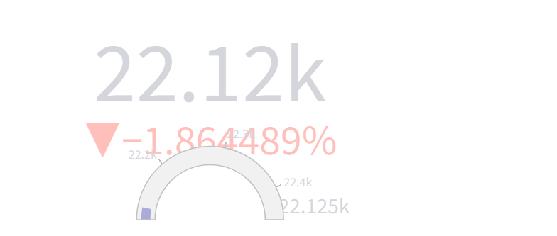

# Market Indices Real-Time Tracker



A real-time dashboard for tracking major Indian market indices built with Streamlit.

## Features

- **Real-time Data**: Fetches live market data for major Indian indices using Yahoo Finance API
- **Interactive Dashboard**: Clean and responsive UI with auto-refresh capabilities
- **Market Overview**: Quick summary of advancing and declining indices
- **Visual Charts**: Graphical representation of index performance
- **Historical Data**: View previous day, week, and month data for comparison
- **Fallback Mechanism**: Uses local CSV data when API is rate-limited

## Indices Tracked

- NIFTY 50
- NIFTY BANK
- NIFTY MIDCAP 100
- NIFTY NEXT 50
- NIFTY 100
- NIFTY 200
- NIFTY 500
- NIFTY SMALLCAP 100
- NIFTY MIDCAP 50
- NIFTY SMALLCAP 50
- BSE SENSEX
- INDIA VIX

## Technology Stack

- **Streamlit**: For the interactive web application
- **Pandas**: For data manipulation
- **Plotly**: For interactive charts
- **YFinance**: For fetching live market data

## Getting Started

1. Clone this repository
2. Install dependencies:
   ```
   pip install -r requirements.txt
   ```
   or
   ```
   pip install pandas plotly streamlit yfinance
   ```
3. Run the application:
   ```
   streamlit run main.py
   ```

## Usage

- The dashboard will load automatically showing the current market data
- Use the sidebar slider to adjust the auto-refresh interval (5-60 seconds)
- View the market overview, major indices cards, and historical data table
- The application will automatically refresh based on your settings

## Data Sources

- Primary: Yahoo Finance API (via yfinance library)
- Fallback: Local CSV file with sample data

## Project Structure

- `main.py`: Main application file with Streamlit UI
- `data_processor.py`: Handles data fetching and processing
- `utils.py`: Helper functions for formatting and visualization
- `attached_assets/`: Contains fallback CSV data

## Rate Limiting

Yahoo Finance API may rate-limit requests. When this happens, the application will automatically fall back to using local CSV data.

## License

MIT

## Contributing

Pull requests are welcome. For major changes, please open an issue first to discuss what you would like to change.
